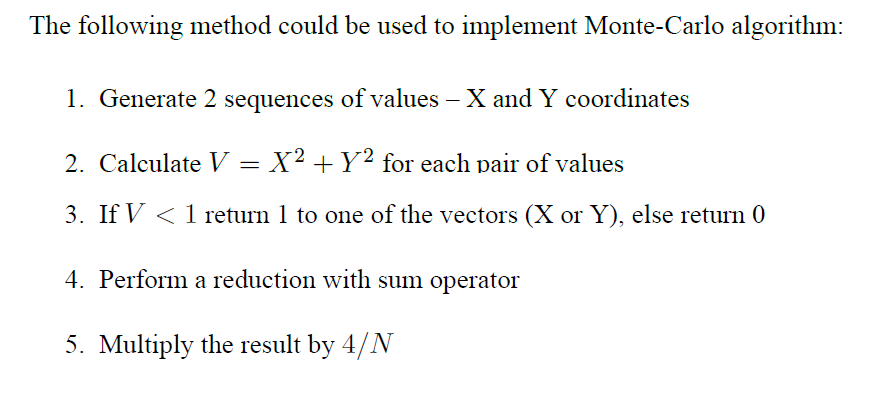

# HPC_вычисление_числа_PI_методом_Монте-Карло
В данном репозитории расположено решение лабораторной работы №2 Вычисление числа PI.  
# Задание на лабораторную и аппаратная база
Задача: реализовать алгоритм вычисления числа PI. 
Учитывая количество точек N, сгенерируйте случайное распределение в области (0; 0)~(1; 1) и вычислите число используя CPU и GPU.
Полученные значения должны быть распечатаны вместе со временем выполнения. 
_Входные данные: количество точек. 
Выходные данные: время выполнения и полученные числа PI._ 
Реализация должна содержать 2 функции вычисления числа PI: на CPU и на GPU с применением CUDA.  
Для реализации данной задачи использовалась следующая аппаратная база: 
Центральный процессор: _Intel Xeon E5-2620 v3 @ 2,4 GHz._ 
Оперативная память: _Kllisre DDR4, 2 × 8 GB, 1600 MHz, DualChannel._ 
Графический процессор: _PALIT GTX 1650 SUPER, 4GB VRAM GDDR6._  
# Реализация алгоритма
Рассмотрим более подробно реализацию данного алгоритма.  
Вычисление числа PI осуществляется с использованием вероятностного метода Монте-Карло. Алгоритм данного метода представлен на рисунке 1.  
  
Фнукция _gpu_calculation_pi()_ производит вычисление числа Pi на графическом процессоре. Функция _cpu_calculation_pi()_ производит вычисления на центральном процессоре. 
Генерация данных производилась на графическом процессоре при помощи библиотеки CURAND, в которой существуютя для этого функции. Функция curand_init инициализирует генератор случайных чисел CUDA. Функция curand_uniform возвращает последовательность псевдослучайных чисел с плавающей запятой, равномерно распределенных между 0,0 и 1,0.  
# Результаты работы программы
Теперь рассмотрим результаты работы программы.
